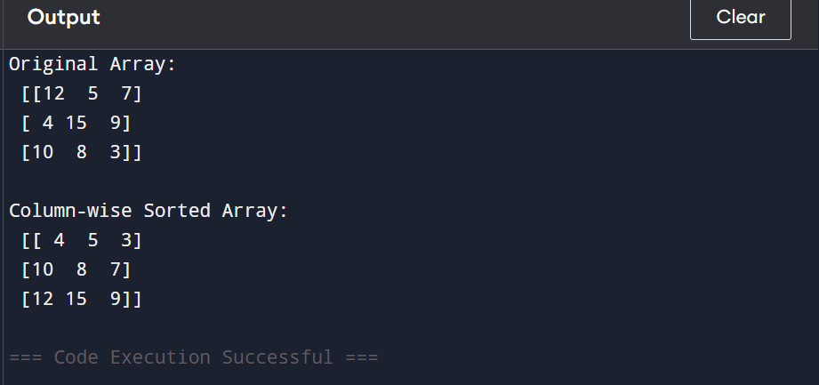

# NumPy Program: Column-wise Sorting of a 2D Array

## 🎯 Aim
To write a **NumPy** program that sorts the elements in each column of a given 2D array in ascending order.

## 🧠 Algorithm

1. **Import NumPy**: Start by importing the NumPy library.
2. **Get Input**: Accept a 2D NumPy array from the user.
3. **Sort Column-wise**: Use the `np.sort()` function with `axis=0` to sort each column in ascending order.
4. **Store Result**: Store the sorted result in a new array.
5. **Display Output**: Print the original array and the column-wise sorted array.

## 🧾 Program
```
import numpy as np

array = np.array([
    [12, 5, 7],
    [4, 15, 9],
    [10, 8, 3]
])

sorted_columns = np.sort(array, axis=0)
print("Original Array:\n", array)
print("\nColumn-wise Sorted Array:\n", sorted_columns)
```

## Output



## Result
NumPy program that sorts the elements in each column of a given 2D array in ascending order is executed successfully.