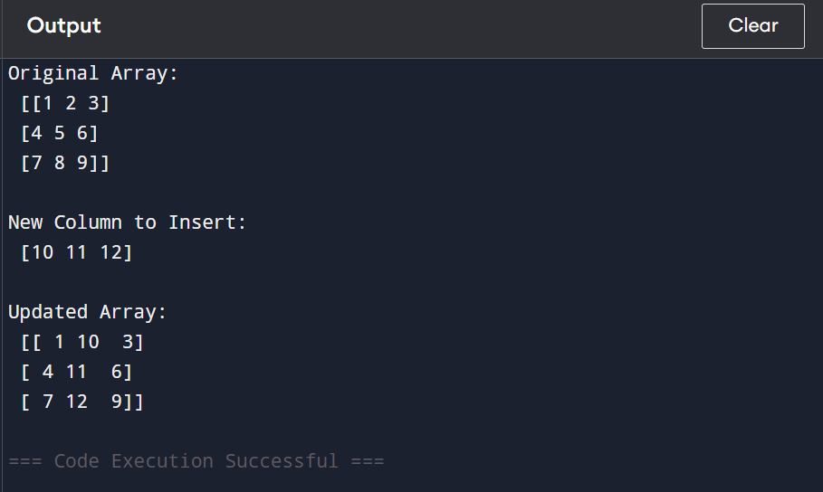

# NumPy Program: Replace the Second Column in a 2D Array

## 🎯 Aim
To write a **NumPy** program that deletes the second column from a given 2D array and inserts a new column at the same position.

## 🧠 Algorithm
1. **Import NumPy**: Start by importing the NumPy library.
2. **Get Input**: Get a 2D NumPy array and a new column (as another array) from the user.
3. **Delete Column**: Use `np.delete()` to remove the second column (index 1) from the original array.
4. **Insert Column**: Use `np.insert()` to insert the new column at the second column's original position.
5. **Display Result**: Print the updated array with the replaced column.

## 🧾 Program
```
import numpy as np


original_array = np.array([
    [1, 2, 3],
    [4, 5, 6],
    [7, 8, 9]
])

new_column = np.array([10, 11, 12])  
array_without_second_col = np.delete(original_array, 1, axis=1)
updated_array = np.insert(array_without_second_col, 1, new_column, axis=1)

print("Original Array:\n", original_array)
print("\nNew Column to Insert:\n", new_column)
print("\nUpdated Array:\n", updated_array)
```

## Output



## Result
NumPy program that deletes the second column from a given 2D array and inserts a new column at the same position is executed successfully.