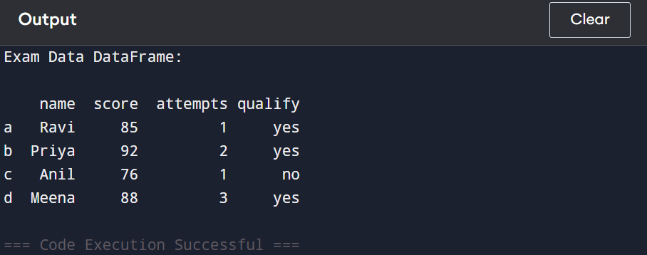

# Pandas Program: Create and Display a DataFrame with Custom Index Labels

## 🎯 Aim

To create and display a **DataFrame** using the **Pandas** library in Python from a given dictionary, and apply specific index labels to the rows.

---

## 🧠 Algorithm

1. **Import Libraries**: Import the required libraries – `pandas` and `numpy`.
2. **Create Dictionary**: Define a dictionary `exam_data` with keys: `'name'`, `'score'`, `'attempts'`, and `'qualify'`.
3. **Index Labels**: Create a list of custom index labels called `labels`.
4. **Create DataFrame**: Use `pd.DataFrame()` to create the DataFrame by passing the dictionary and index labels.
5. **Display Output**: Display the DataFrame using `print()` or by simply calling the DataFrame variable.

---

## 💻 Program
```
import pandas as pd
import numpy as np

exam_data = {
    'name': ['Ravi', 'Priya', 'Anil', 'Meena'],
    'score': [85, 92, 76, 88],
    'attempts': [1, 2, 1, 3],
    'qualify': ['yes', 'yes', 'no', 'yes']
}

labels = ['a', 'b', 'c', 'd']

df = pd.DataFrame(exam_data, index=labels)

print("Exam Data DataFrame:\n")
print(df)
```

## Output



## Result
To create and display a DataFrame using the Pandas library in Python from a given dictionary, and apply specific index labels to the rows is executed successfully.