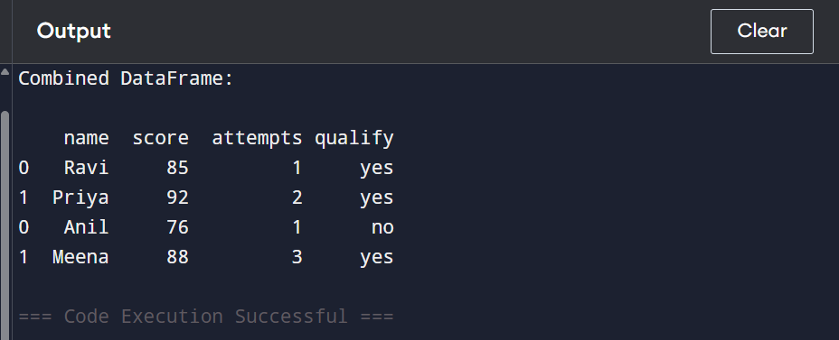

# 🧪 Pandas Program: Join Two DataFrames Along Rows

## 🎯 AIM

To write a Python program using Pandas to **join two DataFrames along rows** (row-wise concatenation) and assign all data to a new DataFrame.

---

## 🧠 ALGORITHM

1. **Import Libraries**: Import the `pandas` library.
2. **Create First DataFrame**: Use a dictionary to create `student_data1`.
3. **Create Second DataFrame**: Use another dictionary to create `student_data2`.
4. **Concatenate DataFrames**: Use `pd.concat()` with `axis=0` to concatenate both DataFrames row-wise.
5. **Display Result**: Print the new combined DataFrame.

---

## 💻 Program
```
import pandas as pd

student_data1 = {
    'name': ['Ravi', 'Priya'],
    'score': [85, 92],
    'attempts': [1, 2],
    'qualify': ['yes', 'yes']
}
df1 = pd.DataFrame(student_data1)
student_data2 = {
    'name': ['Anil', 'Meena'],
    'score': [76, 88],
    'attempts': [1, 3],
    'qualify': ['no', 'yes']
}
df2 = pd.DataFrame(student_data2)
combined_df = pd.concat([df1, df2], axis=0)

print("Combined DataFrame:\n")
print(combined_df)
```

## Output



## Result
Python program using Pandas to join two DataFrames along rows (row-wise concatenation) and assign all data to a new DataFrame is executed successfully.